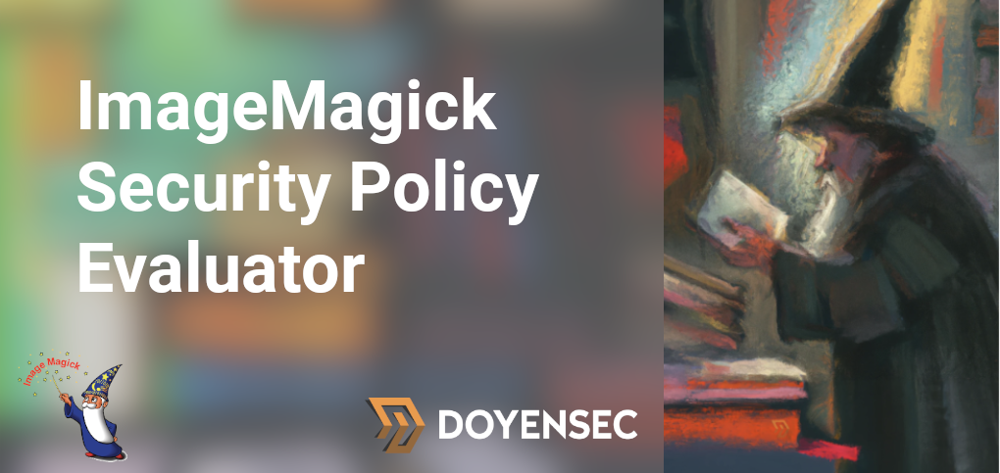

<p>
	<a href="https://doyensec.com">Doyensec</a>'s ImageMagick Security Policy Evaluator allows developers and security experts to check if an XML Security Policy is hardened against a wide set of malicious attacks. It assists with the process of reviewing such policies, which is usually a manual task, and helps identify the best practices for ImageMagick deployments. 
</p>

## CVE-2022-44268

You can protect your installation from arbitrary file reads similar to [CVE-2022-44268](https://www.metabaseq.com/imagemagick-zero-days/) by setting the policy to be:
```xml
  <policy domain="path" rights="none" pattern="*"/> 
  <policy domain="path" rights="read|write" pattern="/tmp/imagemagick-reserved-folder/*"/> 
```
The `/tmp/imagemagick-reserved-folder/` path should be a directory only controlled by the underprivileged user running imagemagick. The evaluator already warns you if the above directives are not set.

## Getting Started

It is possible to use the online version of the tool at https://imagemagick-secevaluator.doyensec.com/.
Otherwise you can serve the tool from your local machine using e.g. Python:

```bash
$ python -m SimpleHTTPServer 8000
```

## Blog Post

Read more about this tool on our <a href="https://blog.doyensec.com/2023/01/10/imagemagick-security-policy-evaluator.html">dedicated blog post</a>.

## License

This project has been sponsored by [Doyensec LLC](https://www.doyensec.com).


